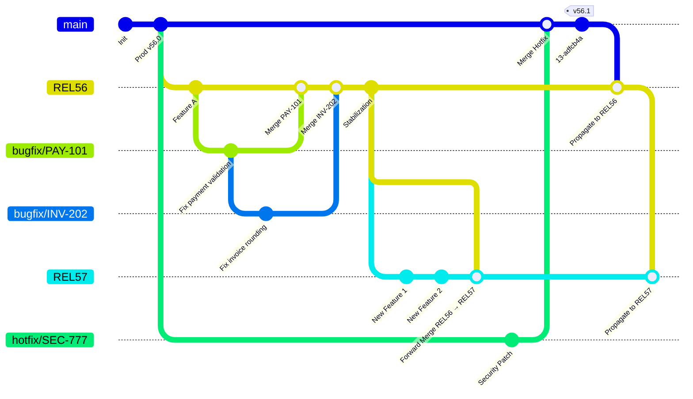

# Popis řízení verzí 

## 1. Účel dokumentu

Tento dokument definuje závazná pravidla pro správu větví (`branch`), verzování (`tag`) a propagaci změn v rámci vývojového cyklu organizace. Cílem je zajistit:

- Konzistentní řízení životního cyklu změn
- Sledovatelnost požadavků a bugfixů
- Deterministickou propagaci změn mezi release větvemi
- Stabilitu produkčního prostředí


---

## 2. Model větví

### 2.1 Základní větve

- `main` → Reprezentuje aktuální produkční stav.
- `RELXX` → Číslované release větve představující připravovaná nebo aktivní vydání.
- Topic branches → Krátkodobé větve pro implementaci bugfixů nebo funkčních úkolů.

### 2.2 Směr propagace

Propagace změn probíhá výhradně dopředným směrem:

```
main → REL56 → REL57 → REL58 → ...
```

Zpětná propagace změn není povolena.

---

## 3. Verzování a označování vydání

### 3.1 Tags

- Pro každé oficiální vydání se používají **annotated tags**.
- Tag reprezentuje neměnný artefakt nasazené verze.
- Tag nesmí být přepisován ani mazán po zveřejnění.

Příklad vytvoření tagu:

```bash
git tag -a v56.0 -m "Release 56.0"
git push origin v56.0
```

Případně:

```bash
git tag -a v56.0 -m "Release 56.0"
git push --tags
```

### 3.2 Konvence pojmenování

- Používat strukturovaný formát `vX.Y`.
- Vyhnout se neformálním nebo nekonzistentním názvům.

Tags slouží jako primární reference pro produkční artefakty.

---

## 4. Životní cyklus release větví

### 4.1 Vývoj v release větvi

Vývoj probíhá v aktuální release větvi (`RELXX`).

Po dokončení přípravy vydání:

1. Provést merge `RELXX → main`.
2. Označit merge commit příslušným tagem.
3. Propagovat změny dopředně do další release větve.

### 4.2 Stav po vydání

Po úspěšném vydání:

- Release větev se uzamkne proti přímým změnám.
- Větev může být později odstraněna.
- Odstranění větve nemá vliv na historii ani na tagy.

Release větve reprezentují vývojovou linii, nikoliv samotné vydání.

---

## 5. Řízení bugfixů

### 5.1 Malé opravy (JIRA úkoly)

Postup:

- Vytvořit krátkodobou feature branch z relevantní release větve.
- Provést rebase na aktuální základ.
- Upravit historii pomocí squash do jednoho commitu.
- Commit message by měla obsahovat referenci na JIRA ticket.
- Provést merge a následně větev odstranit.

Příklad commit message:

```
PAY-214: Oprava chyby zaokrouhlování v kalkulaci
```

Tento přístup zvyšuje sledovatelnost a usnadňuje analýzu pomocí `git blame` i při auditu.

### 5.2 Rozsáhlé funkce

U větších změn (obsahující více Jira tasků):

- Nesquashovat automaticky historii.
- Zachovat strukturované a smysluplné commit zprávy.
- Použít merge commit nebo rebase dle kontextu projektu.

---

## 6. Pravidla dopředné propagace

Veškeré změny musí být propagovány směrem vpřed:

- Pokud je změna integrována do `main`, musí být propagována do všech aktivních release větví vyššího čísla.
- Pokud je změna provedena v release větvi, musí být propagována do vyšších číselných release větví.

Konflikty se řeší při forward merge v integračním bodě, nikoliv předem.

---

## 7. Řízení urgentních oprav

### 7.1 Kritická chyba v produkci

Postup:

1. Vytvořit větev z `main`.
2. Implementovat opravu a otestovat ji.
3. Provést squash merge do `main`.
4. Vytvořit nový patch tag.
5. Propagovat změnu dopředně do všech aktivních release větví.

Řešení konfliktů probíhá během propagace.

### 7.2 Konflikty při propagaci

Pokud urgentní oprava koliduje s budoucí release větví:

- Konflikt se řeší při merge `main → RELXX`.
- Výsledek musí být otestován.
- Konfliktované části jsou součástí integračního commitu.

Dopředná propagace nesmí být obcházena.

### 7.3 Hotfix, který nemá mít mergován

Pokud ugentní oprava nemá mít propgována do dalších větví.

1. Vytvořit větev z `main`.
2. Implementovat opravu a otestovat ji.
3. Ozančit commit jako "NOMERGE" pro snadnou identifikaci takové opravy.
4. Provést squash merge do `main`.
5. Vytvořit nový patch tag.
6. Propagovat změnu dopředně do první releaes větve
7. Přidat revert commit dané úpravy
8. Propagovat změny do všech dalších release větví

Tímto se zajístí, že se hotfix bude propagovat, ale bude hned revertován.


---

## 8. Provozní zásady

- Topic branches jsou dočasné a po merge se odstraňují.
- Release větve jsou po stabilizaci uzamčené.
- Tags definují oficiální vydané verze.
- Commit messages by měly obsahovat ID požadavku.
- Squash je vhodný pro malé uzavřené úkoly.
- Cherry-pick mezi release větvemi se nepoužívá.

Systém je navržen pro podporu čisté historie, transparentní sledovatelnosti a deterministické propagace změn.


---

# Příloha A – Ukázky Git příkazů

Tato sekce obsahuje referenční příklady řešení jednotlivých situací.

---

## A.1 Vytvoření release větve

```bash
# Vytvoření nové release větve z main
git checkout main
git checkout -b REL56

git push -u origin REL56
```

---

## A.2 Malý bugfix (JIRA úkol)

```bash
# Vytvoření topic branch
git checkout REL56
git checkout -b feature/REL56-PAY-214

# Po implementaci
git add .
git commit -m "PAY-214: Oprava zaokrouhlování"

# Rebase na aktuální základ
git fetch origin
git rebase origin/REL56

# Squash před mergem
git rebase -i origin/REL56

# Merge zpět
git checkout REL56
git merge --squash feature/REL56-PAY-214

git commit -m "PAY-214: Oprava zaokrouhlování"
git branch -d feature/REL56-PAY-214
git push origin REL56
```

---

## A.3 Propagace změn dopředu

```bash
# Propagace z main do další release větve

git checkout REL57
git merge main

git push origin REL57
```

Pokud vzniknou konflikty:

```bash
# Řešení konfliktů
# Upravit konfliktní soubory

git add .
git commit
```

---

## A.4 Emergency fix

```bash
# Větev z main

git checkout main
git checkout -b hotfix/PAY-999

# Implementace opravy

git add .
git commit -m "PAY-999: Kritická oprava produkce"

# Merge do main

git checkout main
git merge --squash hotfix/PAY-999

git commit -m "PAY-999: Kritická oprava produkce"

git tag -a v56.1 -m "Patch release 56.1"

git push origin main --tags

git branch -d hotfix/PAY-999
```

## A.5 Emergency fix (revert)

```bash
# Vytvoření feature branch
git checkout main
git checkout -b feature/MAIN-EMERGENCY-123

# Po implementaci
git add .
git commit -m "[NOMERGE] EMERGENCY-123: workaround for critical bug"

# Rebase na aktuální základ
git fetch origin
git rebase origin/main

# Squash před mergem
git rebase -i origin/main

# Merge zpět
git checkout REL56
git merge --squash feature/MAIN-EMERGENCY-123

git checkout REL5

git commit -m "[NOMERGE] EMERGENCY-123: workaround for critical bug"
git branch -d feature/MAIN-EMERGENCY-123
git push origin main

# propagace do rel56
git checkout REL56
git merge main
git push origin REL56

# získání ID commitu (posleních 5 commitů od HEAD)
git log -5 

# revert
git revert --no-edit fe5b8718f2e8dd655ad2e8c0aea241693f5e4bcb
git push 
```


---

# Příloha B – Detailní vizualizace toku větví (Mermaid)

Tato vizualizace zachycuje:
- Paralelní vývoj release větví
- Hotfix větve
- Uzamčení release po vydání
- Propagaci dopředu




Tento diagram ukazuje:

- Hotfix vzniká z `main`
- Hotfix se merguje do `main`
- Tag se vytváří na produkčním stavu
- Změna se propaguje dopředu do release větví
- Budoucí release větve přebírají změny forward mergem

---

